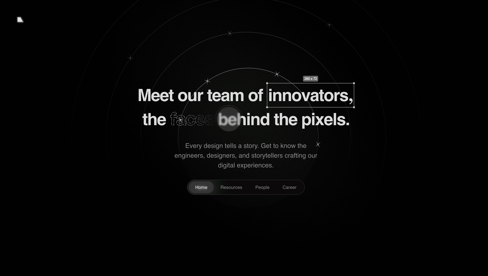

# Varxell Team – Creative Landing Page



A visually-rich, interactive landing page for a fictional Varxell Team, showcasing creative talent, resources, and open career opportunities. Built with React, TypeScript, Vite, and Framer Motion for smooth, modern animations.

#### Live site:

- [Vercel Link](https://varxell-design.vercel.app/)

---

## ✨ Features & Functionality

### Hero Section

- **Animated Title:**
  - Dynamic letter spacing and animated dots around the word "innovators".
  - Responsive measurement of the word's dimensions.
- **Spotlight Glass Effect:**
  - Animated glass highlight sweeps across the text.
- **Animated SVG Word:**
  - Custom SVG animation for the word "faces" using Framer Motion.
- **Logo & Noise Filter:**
  - SVG logo with subtle background noise for texture.

### Navigation

- **Sticky Navbar:**
  - Becomes fixed on scroll.
  - Animated active link highlight using Framer Motion.
  - Smooth section navigation.

### Resources Section

- **Resource Cards:**
  - Interactive cards with illustrations and icons.
  - Hover shine/glow effect.
- **Animated Stars:**
  - SVG "twinkle" star field in the background.

### Team Section

- **Sliding Text:**
  - Animated greetings in multiple languages.
- **Profile Cards:**
  - Team member cards with mouse-tracking radial glow effect that is isolated in the cards.

### Careers Section

- **Join Us Call-to-Action:**
  - Animated call to action button.
- **Ellipse Cursors:**
  - Animated floating badges with team member names and cursor icons, orbiting in an ellipse with random color preset on every render and motion.

### Footer

- **Animated Logo Reveal:**
  - SVG logo with drawn animated outline and animated gradient fill, with a see-saw mouse tracking movement.

---

## 🛠️ Technology Stack

- **React** (with TypeScript)
- **Vite** (for fast development & build)
- **Framer Motion** (`motion/react`) for all animations
- **Vanilla CSS** custom CSS for styling and effects
- **SVG** for icons, illustrations, and animated graphics

---

## 🚀 Getting Started

1. **Install dependencies:**

   ```sh
   npm install
   ```

2. **Run the development server:**

   ```sh
   npm run dev
   ```

3. **Build for production:**

   ```sh
   npm run build
   ```

4. **Preview production build:**
   ```sh
   npm run preview
   ```

---

## 📁 Project Structure

- `src/components/sections/` – Main page sections (Hero, Resources, Team, Careers, Footer)
- `src/components/ui/` – UI components (Navbar, SpotlightGlass, EllipseCursors, etc.)
- `src/assets/` – SVG icons and illustrations
- `src/data/` – Team and resource data
- `src/hooks/` – Custom React hooks for interactivity

---

## 💡 Notable Animations & Interactivity

- **Framer Motion** powers all SVG and UI animations.
- **Mouse-tracking glow** on team cards.
- **Animated SVG paths** for logo and decorative elements.
- **Randomized floating cursors** in the careers section.
- **Responsive design** for all screen sizes.
